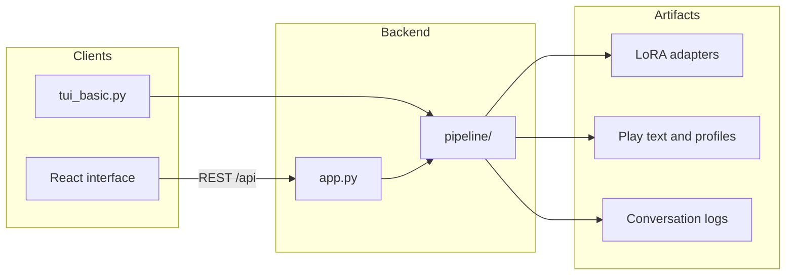
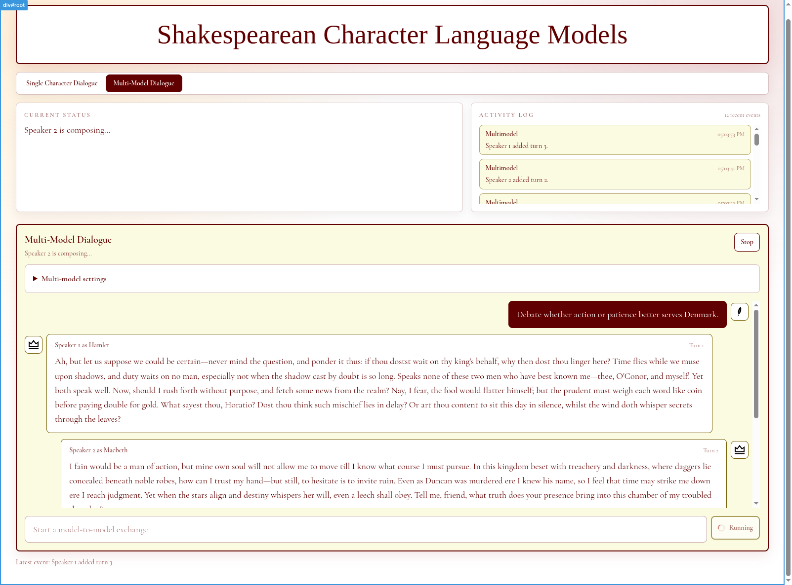
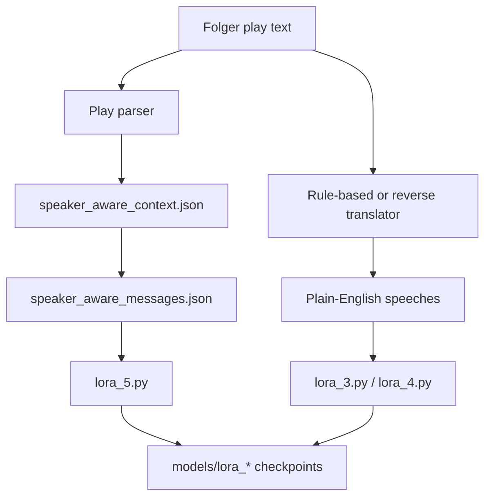
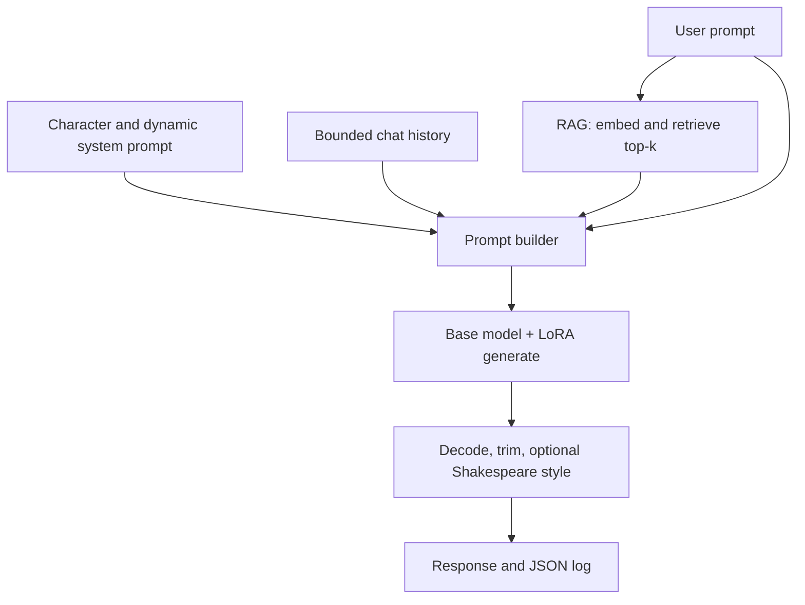
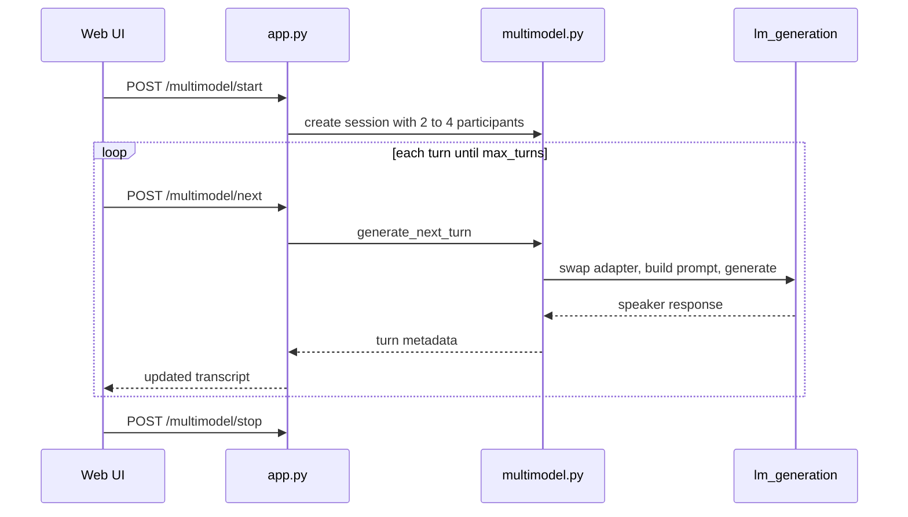

# DSCI490 — Shakespearean Personality LLM Augmentation

This repository develops and evaluates methods for **persona-consistent language models** grounded in Shakespeare's *Hamlet* and *Macbeth*. The project asks whether small open-weight LLMs, fine-tuned with LoRA adapters and runtime context, can sustain believable character voice in single-user chat and in multi-model dialogues.

The end-to-end system includes data preprocessing, iterative LoRA training, retrieval-augmented generation (RAG), a FastAPI inference backend, conversation logging with human feedback, and a React web demo for single-character and model-to-model exchanges.





## Methods

### Data and preprocessing

- **Source texts:** Folger-formatted full plays (`data/hamlet_full_play.txt`, `data/macbeth_full_play.txt`) plus Hamlet-only raw dialogue (`data/hamlet_onlyhamletraw.txt`).
- **Play parsing:** Scripts extract speaker blocks, preserve act/scene structure, and build turn-level datasets.
- **Shakespeare → modern English:** Early pipelines use rule-based normalization (29 case-aware regex rewrites). Later pipelines use a learned **reverse translator** (`training/translations/`, TensorFlow seq2seq with SentencePiece tokenizers) with rule-based fallback when checkpoints degenerate.
- **Speaker-aware context windows:** For each target-speaker reply, the pipeline keeps the last *k* non-target turns (and optionally the speaker's prior line) as conversational context, exported as JSON then converted to chat-style `messages` arrays for supervised fine-tuning.
- **Character profiles:** Structured JSON profiles (`data/character_profile_hamlet.json`) capture traits, relationships, and plot facts for prompt grounding and benchmark design.



### Model training (LoRA adapters)

Training scripts live under `training/` and follow an iterative refinement path:

| Stage | Script | Approach |
|-------|--------|----------|
| Baseline | `lora_3.py` | Hamlet-only raw dialogue + rule-based plain-English normalization |
| Translator-augmented | `lora_4.py` | Hamlet speeches rewritten via the reverse translator before training |
| Context-aware | `lora_5.py` | Message-style records with speaker-aware dialogue history (`hamlet_speaker_aware_messages.json`) |
| Macbeth expansion | `lora_5.py` (Macbeth data) | Same context-window pipeline applied to *Macbeth* |

Key training choices: **PEFT LoRA** on open chat models, 4-bit NF4 loading with bitsandbytes on CUDA, gradient accumulation for memory-constrained GPUs, and automatic dataset rebuild when speaker/*k*/prompt settings change.

Saved adapters in `models/` include:

- **`lora_hamlet_3`** — dialogue + character profile mix (LiquidAI/LFM2-2.6B)
- **`lora_hamlet_5`** — first context-aware Hamlet adapter trained on speaker-aware windows
- **`lora_hamlet_5_2`** — improved context windows with scene-boundary enforcement; excludes Act 5 Scene 2 leakage
- **`lora_hamlet_5_3`** — tests **dynamic system prompts** that shift Hamlet's tone by interlocutor (Claudius, Ophelia, Horatio, etc.)
- **`lora_macbeth_1`** — context-aware Macbeth adapter using the same message-style pipeline

### Runtime inference pipeline

The `pipeline/` library powers all generation:



1. **Model loading** — one resident base model with hot-swappable LoRA adapters (`pipeline/utils.py`, `pipeline/lm_generation.py`).
2. **Persona prompts** — static character/work system prompts plus optional relationship-aware extensions (`pipeline/dynamic_system_prompt.py`).
3. **RAG** — `SentenceTransformer('all-MiniLM-L6-v2')` embeddings over character profiles and speaker-aware context JSON; top-*k* passages injected at generation time (`pipeline/rag.py`).
4. **Chat history** — role-tagged message history with bounded context trimming and anti-repetition retries (including temporary LoRA disable on loop detection).
5. **Optional Shakespeare polish** — light post-processing (`you` → `thou`, etc.) when `shakespeare_style` is enabled.
6. **Multimodel orchestration** — in-memory round-robin sessions for 2–4 adapter-equipped speakers sharing one base model (`pipeline/multimodel.py`).



### Evaluation and feedback

- **Benchmarking** (`benchmarking/`): cosine-similarity scoring over `all-MiniLM-L6-v2` embeddings in `benchmark_development.ipynb`; a planned **PerSEval** integration (`benchmarking/perseval_plan.md`) adds DEGRESS (voice fidelity), ADP (factual contradiction via NLI), and ACP (cross-response consistency) with plain-English normalization aligned to training.
- **Conversation logging** (`logging/`): JSON logs for single-chat and multimodel runs with timestamps, model/adapter metadata, and turn history.
- **Human feedback** — the web UI collects per-message votes and span-level highlights, stored alongside logs for future preference learning (DPO planned; see `docs/rLStrategies.md`).
- **CLI parity** — `tui_basic.py` mirrors the web demo flow for headless testing.

## Results and findings

- **Iterative LoRA refinement improved in-character coherence.** Moving from raw/normalized single-turn data (`lora_3`) to speaker-aware multi-turn windows (`lora_5`, `lora_5_2`) produced responses that better tracked conversational context and scene structure.
- **Dynamic system prompts (`lora_hamlet_5_3`)** allow relationship-conditioned tone (e.g., contempt toward Claudius, warmth toward Horatio) without retraining separate adapters per interlocutor.
- **Macbeth persona (`lora_macbeth_1`)** demonstrates the pipeline generalizes beyond Hamlet using the same preprocessing and message-style training format.
- **Multimodel dialogues** run successfully with Hamlet and Macbeth adapters on a shared base model; sessions are logged and visible in the web demo's activity feed (see screenshot above).
- **Remaining failure modes** include occasional modern-language drift, meta-AI acknowledgments under adversarial prompts, and repetition on smaller base models — motivating the PerSEval benchmark and planned DPO retraining from logged preferences.

Further planning notes and citations live in [`docs/`](docs/).

## Project structure

| Path | Contents |
|------|----------|
| [`app.py`](app.py) | FastAPI backend — model selection, generation, multimodel sessions, TTS, feedback |
| [`pipeline/`](pipeline/) | Core library — ingestion, RAG, generation, multimodel orchestration, logging, TTS |
| [`interface/`](interface/) | React + Vite + Tailwind web demo (single chat and multi-model tabs) |
| [`data/`](data/) | Play texts, character profiles, speaker-aware JSON datasets |
| [`models/`](models/) | LoRA adapter checkpoints and `models.py` registry |
| [`training/`](training/) | LoRA training scripts, play parsers, translator utilities |
| [`training/translations/`](training/translations/) | Legacy TensorFlow Shakespeare ↔ modern English translator |
| [`benchmarking/`](benchmarking/) | Benchmark notebooks and PerSEval integration plan |
| [`logging/`](logging/) | Generated conversation and multimodel run logs |
| [`tests/`](tests/) | Pytest suite (`bash run_tests.sh`) |
| [`testing/`](testing/) | Standalone integration scripts (e.g., translator checks) |
| [`docs/`](docs/) | Roadmap, pipeline flow, multimodel plan, RL strategies, citations |
| [`misc/`](misc/) | Ad-hoc experiment scripts and notebooks |
| [`tui_basic.py`](tui_basic.py) | Terminal CLI mirroring the web demo |
| [`Dockerfile`](Dockerfile) | Multi-stage build — Vite frontend + Python runtime |
| [`runWebDemo.sh`](runWebDemo.sh) | Starts backend and frontend together |

## Running the web demo

Clone the [repository](https://github.com/bmccorison/DSCI490-Shakespearean-Personality-LLM-Augmentation-/tree/main), then set up and start the demo from the project root:

```bash
git clone https://github.com/bmccorison/DSCI490-Shakespearean-Personality-LLM-Augmentation-.git
cd DSCI490-Shakespearean-Personality-LLM-Augmentation-
```

From the repository root:

```bash
python3 -m venv .venv && source .venv/bin/activate
pip install -r requirements.txt
bash runWebDemo.sh
```

The backend listens on `http://127.0.0.1:8000` (override with `BACKEND_PORT`). The Vite dev server runs on port `6969` by default. A `.venv/bin/python3` is preferred automatically when present.

**Docker:**

```bash
docker build -t shakespeare-lm .
docker run --gpus all -p 8000:8000 -v "$(pwd)/logging:/app/logging" shakespeare-lm
```

**CLI alternative:**

```bash
python tui_basic.py --help
```

## Testing

```bash
bash run_tests.sh          # pytest via uv (see uv_config/)
python -m py_compile pipeline/*.py   # syntax check (matches CI)
cd interface && npm ci && npm run build
```

## Documentation

- [`docs/pipelineFlow.md`](docs/pipelineFlow.md) — endpoint-to-pipeline mapping
- [`docs/multimodelPlan.md`](docs/multimodelPlan.md) — multi-model conversation architecture
- [`docs/roughRoadmap.md`](docs/roughRoadmap.md) — project phases and milestones
- [`training/README.md`](training/README.md) — full-play preprocessing and LoRA pipeline steps

---

## Technologies

### Base models and fine-tuning

| Component | Details |
|-----------|---------|
| Base models | [TinyLlama/TinyLlama-1.1B-Chat-v1.0](https://huggingface.co/TinyLlama/TinyLlama-1.1B-Chat-v1.0), [LiquidAI/LFM2-2.6B](https://huggingface.co/LiquidAI/LFM2-2.6B), [LiquidAI/LFM2-8B-A1B](https://huggingface.co/LiquidAI/LFM2-8B-A1B) |
| Fine-tuning | [PEFT](https://github.com/huggingface/peft) LoRA adapters via [Transformers](https://github.com/huggingface/transformers) `Trainer` |
| Quantization | [bitsandbytes](https://github.com/TimDettmers/bitsandbytes) 4-bit NF4 loading; [Accelerate](https://github.com/huggingface/accelerate) device mapping and CPU offload |
| Inference runtime | PyTorch with CUDA/MPS/CPU fallback; expandable CUDA segments for memory pressure |

### Retrieval, embeddings, and evaluation

| Component | Details |
|-----------|---------|
| Embeddings | [Sentence Transformers](https://www.sbert.net/) — `all-MiniLM-L6-v2` for RAG retrieval and benchmark similarity |
| RAG store | In-memory vector store built from character profile JSON + speaker-aware context JSON; lazy-loaded and keyed by character |
| Benchmark scoring | scikit-learn cosine similarity (current); planned PerSEval with `cross-encoder/nli-deberta-v3-small` for factual contradiction |
| Data tooling | NumPy, pandas, scikit-learn, matplotlib/seaborn (notebooks) |

### Shakespeare translation (legacy training aid)

| Component | Details |
|-----------|---------|
| Framework | TensorFlow 2.x seq2seq transformer (`training/translations/model.py`, `translator.py`, `translator_reverse.py`) |
| Tokenization | SentencePiece (2k-vocab modern/original tokenizers in `training/translations/tokenizers/`) |
| Training data | Parallel modern/Shakespeare corpora scraped from Folger and supplemental sources |
| Inference modes | Beam-search faithful translation and temperature-sampled generative translation with Minimum Bayes Risk selection |

### Backend and API

| Component | Details |
|-----------|---------|
| Web framework | [FastAPI](https://fastapi.tiangolo.com/) + [Uvicorn](https://www.uvicorn.org/) |
| Validation | [Pydantic](https://docs.pydantic.dev/) request/response models |
| CORS | Configurable via `CORS_ALLOW_ORIGINS` (defaults to `localhost:6969`) |
| Static assets | Built Vite `interface/dist` served in production/Docker |
| TTS cascade | Bark → Piper → espeak fallback (`pipeline/tts.py`); ElevenLabs listed in requirements for optional cloud TTS |
| Logging | JSON conversation logs with UUIDs (`pipeline/local_logging.py`); span-weight feedback store |

### Frontend

| Component | Details |
|-----------|---------|
| Framework | React 18 (function components, JSX) |
| Build | Vite 5 with `@vitejs/plugin-react` |
| Styling | Tailwind CSS 3; Newsreader serif typography and parchment/red palette ([`interface/DESIGN.md`](interface/DESIGN.md)) |
| API surface | REST under `/api` — model/character selection, generation, multimodel start/next/stop, TTS, feedback |

### DevOps and dependencies

| Component | Details |
|-----------|---------|
| Python | 3.11 (CI and Docker); root `requirements.txt` for pip installs |
| Optional env manager | `uv_config/` with lockfile for `uv run` test invocation |
| CI | GitHub Actions — `pipeline/` syntax check + `interface` production build |
| Container | Multi-stage Dockerfile (Node 20 frontend build → Python 3.11-slim runtime) with HuggingFace cache volume |
